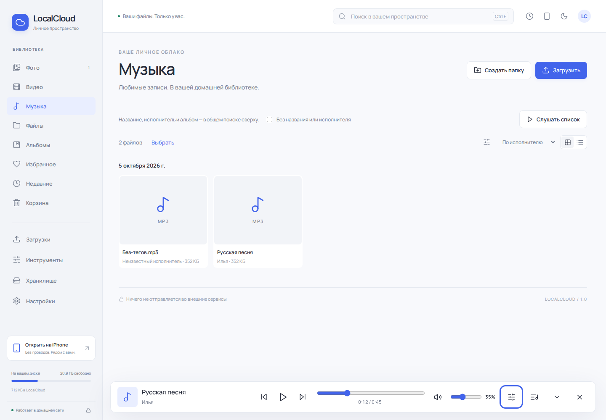

# LocalCloud 1.0.0

**Ваши файлы. Ваш компьютер. Ваша домашняя сеть.**

[English documentation](README.md) · [Установка](#установка) · [Обновление](#обновление-существующей-установки) · [Сборка](#сборка-из-исходников) · [Публикация](docs/PUBLISHING.md) · [Лицензия](LICENSE.ru.md)

LocalCloud превращает компьютер Windows в личную библиотеку файлов и медиа. Запустите приложение, выберите обычную папку на диске и открывайте библиотеку в приложении, браузере компьютера или на телефоне в домашней сети. Фотографии, видео, музыка и документы остаются в ваших физических папках. Не нужны аккаунт облачного сервиса, подписка или арендованный сервер.

Это первый **публичный релиз 1.0.0**, основанный на предыдущей версии разработки 1.4.0. Нумерация публичных версий начинается заново, возможности сохраняются. SQLite остаётся на **схеме 4**. Для существующей 1.4.0 предусмотрен отдельный проверяемый переход.

Автор — **Илья Гаврилов / Ilya Gavrilov**. Проект создан со значительной помощью инструментов ИИ, включая ChatGPT/Codex, под руководством автора. В самой программе нет интеграции ИИ или зависимости от Ollama. Исходники доступны на условиях собственной **source-available лицензии**, а не свободной лицензии без ограничений. Прочитайте [NOTICE.md](NOTICE.md), [LICENSE](LICENSE) и [русский перевод](LICENSE.ru.md).



## Содержание

- [Требования](#требования)
- [Файлы релиза](#файлы-релиза)
- [Установка](#установка)
- [Первый запуск и подключение телефона](#первый-запуск-и-подключение-телефона)
- [Возможности](#возможности)
- [Где хранятся данные](#где-хранятся-данные)
- [Обновление существующей установки](#обновление-существующей-установки)
- [Резервные копии, восстановление и удаление](#резервные-копии-восстановление-и-удаление)
- [Безопасность и приватность](#безопасность-и-приватность)
- [Решение проблем](#решение-проблем)
- [Ограничения](#ограничения)
- [Сборка из исходников](#сборка-из-исходников)
- [Структура проекта и проверки](#структура-проекта-и-проверки)
- [Публикация и использование кода](#публикация-и-использование-кода)

## Требования

| Компонент | Что нужно |
| --- | --- |
| Компьютер | Windows 11, x64. Windows 10 x64 — без подтверждённого физического тестирования этого релиза. |
| .NET | Среда выполнения уже включена. SDK для использования программы не нужен. |
| Окно приложения | Microsoft Edge **WebView2 Evergreen Runtime**. Использовать Edge как основной браузер не требуется. |
| Браузер | Современный браузер с JavaScript, cookies и локальным хранилищем. Safari подходит с учётом ограничений iOS. |
| Телефон | Доступ к доверенной домашней сети; компьютер включён, сервер работает. |
| Диск | Около 1 ГБ для установки, временной распаковки и зависимостей; отдельно место для файлов, кэша и копий обновления. |
| Медиа | FFmpeg и FFprobe в `server/tools` или PATH. Установщик может загрузить их напрямую у поставщика. |

Интернет нужен при установке, если выбрана загрузка отсутствующих WebView2 или FFmpeg. Основная программа работает локально. Отдельный WebView2 может обновляться средствами Microsoft.

**Языки:** установщик и первое окно выбора библиотеки поддерживают русский и английский. Веб-интерфейс и большинство команд трея пока на русском. Полная английская локализация приложения не входит в 1.0.0.

## Файлы релиза

Откройте **Releases** этого репозитория. Для готовой программы скачивайте приложенные файлы релиза, а не автоматически создаваемый GitHub архив исходников.

| Файл | Для чего |
| --- | --- |
| `LocalCloud-1.0.0-Setup-x64.exe` | Установка Windows с выбором RU/EN, ярлыками, записью удаления и дополнительной загрузкой зависимостей. Для новых пользователей. |
| `LocalCloud-1.0.0-Windows-x64-Core.zip` | Переносимая программа со средой .NET. WebView2 и FFmpeg предоставляются отдельно. |
| `LocalCloud-1.0.0-Windows-x64-Update.zip` | Обновление программы, в том числе переход с разработки 1.4.0 на публичную 1.0.0. Существующие медиа-инструменты сохраняются. |
| `LocalCloud-1.0.0-Source.zip` | Чистые исходники для репозитория, документация и сценарии сборки/установки. Без личной библиотеки и результатов сборки. |
| `SHA256SUMS-1.0.0.txt` | Контрольные суммы файлов релиза. |

В Setup/Core **не распространяются бинарники FFmpeg**. При выборе соответствующего компонента установщик загружает неизменённый архив FFmpeg 9.0.2 essentials напрямую с [сайта Gyan Doshi](https://www.gyan.dev/ffmpeg/builds/), проверяет закреплённую SHA-256 и сохраняет уведомления поставщика. FFmpeg/FFprobe — отдельные инструменты со своими условиями GPL. Лицензия LocalCloud не отменяет эти условия.

## Установка

1. Скачайте `LocalCloud-1.0.0-Setup-x64.exe` из официального релиза.
2. Запустите и выберите **Русский** или **English**.
3. Прочитайте условия и выберите **папку программы**. По умолчанию — `%LOCALAPPDATA%\Programs\LocalCloud`.
4. Оставьте выбранными медиа-инструменты, если нужны миниатюры видео, метаданные, видеопрокси и запись тегов в MP3. Если WebView2 отсутствует, выберите его установку.
5. Завершите установку и запустите LocalCloud через ярлык.

Программа устанавливается для текущего пользователя Windows. Отдельная установка зависимостей или разрешение брандмауэра может вызвать системный запрос. Папка программы и папка библиотеки должны быть разделены. Установка поверх распознанной программы выполняется через проверяемый updater, а не слепое копирование файлов.

EXE этого релиза не имеет подписи Authenticode. Windows может показать предупреждение репутации нового приложения. Проверяйте источник и контрольную сумму; одноимённый файл из другого места не становится официальным автоматически.

### Переносимая версия

Распакуйте Core **целиком** в отдельную папку, установите WebView2 и предоставьте FFmpeg/FFprobe, затем запустите `LocalCloud.exe`. Один EXE без папок `server`, `updater` и файлов среды выполнения не работает. Переносимый архив не создаёт ярлыки и запись удаления автоматически.

## Первый запуск и подключение телефона

В первом окне выберите **папку библиотеки**, например `D:\LocalCloudLibrary`. Можно включить запуск с Windows и доступ из домашней сети. Программа создаёт стандартные `Photos`, `Videos`, `Music`, `Files`, индекс и служебные данные — в `.localcloud`.

Подключение телефона:

1. Подключите телефон и компьютер к одной доверенной сети. Гостевая сеть может запрещать связь между устройствами.
2. Включите домашний сетевой доступ в LocalCloud.
3. Откройте QR или показанный адрес вида `http://192.168.1.20:43110` в Safari/другом браузере телефона. `localhost` на телефоне обозначает телефон, а не компьютер.
4. Если адрес недоступен, откройте **Инструменты → Диагностика сети**: адреса, фактический listener, сетевой профиль и брандмауэр Windows.
5. При необходимости разрешите LocalCloud для частной домашней сети предусмотренной командой.

Стандартный порт — **43110**. IP и QR не требуют работающего mDNS. Проверка соединения, выполненная самим компьютером, не доказывает, что конкретный iPhone видит сервер.

В Safari можно выбрать **На экран «Домой»**. Для больших загрузок держите вкладку видимой: iOS может приостанавливать браузер в фоне и при блокировке. Это браузерный доступ, а не нативный iOS-клиент и не автоматическая синхронизация фотоплёнки.

## Возможности

### Загрузки и файлы

- Возобновляемые tus-передачи чанками по 8 МБ, очередь, настраиваемая параллельность, пауза, продолжение, повторы и отмена.
- Сохранение подтверждённого смещения незавершённой загрузки. После повторного открытия выберите тот же исходный файл и папку назначения.
- Побайтовые дубликаты определяются по SHA-256: пропустить или сохранить отдельную копию.
- Исходные имена сохраняются; при совпадении добавляется понятный суффикс.
- Физические вложенные папки, создание, переименование, перенос, копирование, множественное выделение и контекстное меню на ПК.
- Прямой пункт истории загрузок в навигации.
- Изменения через Проводник подхватываются адресным watcher; согласующая проверка выполняется при запуске, при необходимости, периодически и вручную.

### Фото и Live Photos

- Галерея и список, ленивые превью, поиск, фильтры по датам/расширению/размеру, сортировка и виртуализация строк.
- JPEG/PNG/WebP/GIF/BMP/TIFF, HEIC/HEIF/AVIF при поддержке декодеров и корректности исходного файла.
- Увеличение, перемещение, свайпы, клавиатура и метаданные.
- Неразрушающие поворот, кадрирование и экспозиция: результат экспортируется отдельным JPEG.
- Live Photo пары по доступному Apple content ID, затем обозначенный fallback по одинаковому имени без расширения в одной папке. Операции с парой учитывают фото и видео.

### Видео

- Воспроизведение оригиналов с HTTP Range: перемотка не требует предварительно скачать всё видео.
- FFmpeg-миниатюры и FFprobe-метаданные.
- Создание отдельного H.264/AAC прокси по запросу. Оригиналы автоматически не перекодируются.
- Реальное воспроизведение зависит от кодеков браузера: наличие файла в индексе не гарантирует поддержку его кодека на всех устройствах.

### Музыка

- Постоянный плеер между разделами, компактный режим, очередь, перемешивание и повтор.
- Сохранение очереди, текущего трека, позиции, громкости, mute и вида отдельно на устройстве. После восстановления **нет автозапуска**.
- Поиск по названию, исполнителю, альбому; соответствующая сортировка и фильтр отсутствующего названия/исполнителя.
- Media Session при поддержке браузера и системы.
- Клавиатура: `Space` — пауза/воспроизведение; `Alt + ←/→` — предыдущий/следующий; `M` — mute. Ввод в полях и диалоги защищены от случайных горячих клавиш.
- Подписи LocalCloud сохраняются отдельно от встроенных тегов исходного файла.
- Запись физических MP3-тегов требует предпросмотра и отдельного подтверждения. Проверяются копия оригинала и аудиопоток; изменившийся после просмотра файл не перезаписывается.

Ограничения браузера сохраняются. На iOS громкость может управляться самим устройством, а автозапуск и Media Session зависят от клиента.

### Документы и организация

- Локальный PDF.js, страницы и увеличение.
- Для подходящих незашифрованных PDF до 64 МБ: поворот/удаление страниц и новые текстовые пометки в отдельной копии. Существующий текст документа не редактируется на месте.
- Виртуальные альбомы, избранное, недавние, сохранённые фильтры и умные альбомы.
- Массовое переименование с preview и явное распределение файлов непосредственно в стандартных папках. Пользовательские вложенные папки сохраняются.
- Корзина, восстановление с обработкой совпадений и подтверждение удаления навсегда. Пустая папка не является отдельной записью корзины.
- Ручная проверяемая копия в другую локальную/UNC папку, предыдущие версии и согласованный снимок метаданных.
- Отзываемые ссылки с ограничением срока на выбранную папку; опциональный Radmin доступ через ограниченный sharing API.

### Приложение и диагностика

- Windows-окно на WebView2, доступ через браузер и трей: открыть, запустить, остановить, перезапустить, выйти.
- Прямая навигация **Музыка, Загрузки, Инструменты**.
- Светлая/тёмная/системная тема, адаптация телефона/планшета/ПК, локальные шрифты и PDF-ресурсы.
- Память/CPU сервера, медиапроцессы, текущая фоновая задача и пауза обработки.
- Уменьшение повторных сканирований, объединение файловых событий, ограниченная медиаработа и отсутствие постоянного перерисовывания галереи из-за позиции музыки.

## Где хранятся данные

| Путь | Содержимое |
| --- | --- |
| `%LOCALAPPDATA%\Programs\LocalCloud` или выбранная папка установки | Программа, веб-ресурсы и среда выполнения. |
| `D:\LocalCloudLibrary` или выбранная библиотека | Оригиналы в обычных физических папках. |
| `<библиотека>\.localcloud\database.sqlite` | Индекс, альбомы, избранное и метаданные приложения. |
| `<библиотека>\.localcloud\cache` | Перестраиваемые миниатюры и прокси. |
| `<библиотека>\.localcloud\uploads` | Незавершённые передачи. |
| `<библиотека>\.localcloud\trash` | Оригиналы в корзине. |
| `<библиотека>\.localcloud\backups\audio-tags` | Оригинальные MP3 перед записью физических тегов. |
| `%LOCALAPPDATA%\LocalCloud\settings.json` | Выбранное хранилище и настройки. |
| `%LOCALAPPDATA%\LocalCloud\language.txt` | Язык установки/первого нативного окна. |

Оригинальные файлы не записываются в SQLite. Удаление базы теряет виртуальные альбомы и избранное, даже если сами фотографии остаются. Перестройка кэша не равна удалению базы. Один диск — не резервная копия.

## Обновление существующей установки

### Разработка 1.4.0 → публичная 1.0.0

Используйте **новый** Setup либо Update ZIP публичного релиза. Выбирайте **существующую папку программы**, а не библиотеку. Старый updater 1.4.0 не знает о смене нумерации и сочтёт её откатом.

Обновление через ZIP:

1. Завершите важные активные передачи. Распакуйте Update во временную папку **вне программы и библиотеки**.
2. Запустите `Update-LocalCloud.cmd`, выберите папку с существующим `LocalCloud.exe` и `server`.
3. Прочитайте определённые пути и подтвердите проверяемое обновление.
4. После завершения открывайте установленную программу. Временную папку Update можно удалить.

Updater проверяет SHA-256 заменяемых и сохранённых компонентов, свободное место и разделение путей, ждёт активную работу, останавливает принадлежащие программе процессы и сохраняет копии приложения, настроек и SQLite. Оригиналы, идентификаторы файлов, альбомы, избранное, корзина и состояния незавершённых передач сохраняются. Копия обновления не содержит полную копию всех медиа.

Исключение нумерации действует только для **разработки 1.4.0 → публичной 1.0.0 при схеме 4**. Более новая база или уже публичная более новая версия не могут использовать это исключение для отката. Следующие публичные версии — 1.0.1, 1.1.0 и далее.

Частно пользоваться существующей 1.4.0 можно и дальше. Переход добавляет упаковку публичного релиза, двуязычную установку, документацию и новую идентификацию версии; библиотеку заново создавать не нужно.

## Резервные копии, восстановление и удаление

Важную библиотеку и конфигурацию копируйте на другой диск. Встроенная проверяемая копия запускается вручную; автоматического расписания нет.

Снимки обновления находятся в `<программа>\_update_backup\<дата>`. Перед откатом прочитайте [UPDATE-USER.txt](UPDATE-USER.txt). Совместимый откат приложения сохраняет текущую базу. Явное восстановление базы возвращает метаданные на момент копии и требует отдельного подтверждения; оригиналы не удаляет.

Для Setup-установки: **Windows → Установленные приложения → LocalCloud → Удалить**. Сначала завершите LocalCloud через трей. Удаляются известные файлы программы, её ярлыки и регистрация. Библиотека, настройки, снимки обновления и неизвестные файлы сохраняются; поэтому непустая папка программы может остаться. Переносимую версию закрывайте и удаляйте только её папку программы, предварительно убедившись, что там нет личной библиотеки.

## Безопасность и приватность

LocalCloud рассчитан на доверенную частную сеть, а не на публичный интернет-сервис. Не пробрасывайте HTTP-порт роутера и не публикуйте сервер через внешний reverse proxy без отдельного проекта защиты.

- Опциональный PIN: производный хэш, HttpOnly-сессия и ограничение попыток.
- Проверки путей, Host/Origin/LAN и запрет symlink/junction при доступе к оригиналам.
- Чувствительные административные действия ограничены; ссылка на папку не даёт полного доступа владельца.
- Ссылки bearer: обладатель подходящей ссылки и сетевого доступа может пользоваться ей до отзыва/истечения срока.
- Запрет скачивания ограничивает выдачу оригиналов там, где применим; проигрываемый браузером контент технически можно скопировать.
- HTTP в LAN не шифрует соединение. PIN не заменяет TLS.
- EXIF/GPS, SQLite и логи могут содержать личные сведения. Не публикуйте их без просмотра.
- Приложению не нужны телеметрия, ИИ-модель или внешний аккаунт. Выбранные загрузки зависимостей установщиком — явные внешние запросы.

## Решение проблем

| Проблема | Что проверить |
| --- | --- |
| Телефон не открывает страницу | Сервер, одинаковая сеть, правильный IP/порт, гостевая изоляция, LAN, частный профиль и брандмауэр Windows. |
| Окно приложения не открывается | WebView2 установлен; попробуйте адрес сервера в браузере. |
| Нет видеопревью/записи MP3 | Нужны FFmpeg и FFprobe в `server/tools` либо PATH, затем перезапуск приложения. |
| Зависимости не загрузились | Интернет, повтор установки; можно продолжить с ядром и установить зависимости вручную от официальных поставщиков. |
| Передача замирает у границы чанка | Видимая вкладка, сеть, состояние очереди; пауза/продолжение, повторный выбор того же исходника после открытия. При повторении — логи. |
| Найден дубликат | SHA-256 совпадает; выберите пропуск или отдельную копию. |
| Видео есть, но не играет | Поддержка кодека в браузере; создайте отдельный прокси. |
| Обновление отвергает путь | Папка реальной программы отделена от библиотеки; Update распакован отдельно. |
| Не совпадает сохранённый компонент | Установка отличается от исходной; используйте публичный Setup для проверяемого полного обновления/ремонта. |
| После удаления SQLite пропали альбомы | Альбомы находятся в метаданных; восстановите копию базы. |

Логи — `<библиотека>\.localcloud\logs`. Точная граница проверок: [docs/QA-public-1.0.md](docs/QA-public-1.0.md). В сообщении об ошибке укажите версию, Windows/браузер и шаги воспроизведения; не публикуйте PIN, токены доступа, личные фото или целую базу.

## Ограничения

- Setup собран на Linux. Нативное окно Windows, UAC, ярлыки, удаление и трей требуют проверки на настоящем компьютере перед заявлением, что они физически проверены.
- Реальный iPhone/Safari, скорость домашней сети и передачи десятков ГБ не проверялись физически в среде сборки.
- Нет нативного iOS-клиента, фоновой автозагрузки фотоплёнки, прямого USB/PTP/WPD-импортера, семейных аккаунтов и trusted devices.
- USB-кабель не складывает скорость с Wi-Fi. Отдельный импорт Windows и реально доступный сетевой tethering — самостоятельные способы.
- HTTP LAN не является secure context; полноценный offline Service Worker требует HTTPS или localhost. Ярлык на домашнем экране это не меняет.
- Live Photo пары, метаданные, HEVC и регулировка громкости зависят от исходников и клиента.
- Внешние диски/UNC должны оставаться доступны; не отключайте хранилище при активной работе.
- Нет автоматической проверки и загрузки интернет-обновлений; пакеты применяются локально.
- Полная английская локализация веб-интерфейса — отдельная будущая работа.

## Сборка из исходников

Для разработки: **.NET SDK 10**, **Node.js 22.12+ либо 24**, npm, Python 3; для Setup — **NSIS 3**. Пользователю готовой программы они не нужны.

Из корня репозитория Windows:

```powershell
powershell -NoProfile -ExecutionPolicy Bypass -File scripts/build.ps1
powershell -NoProfile -ExecutionPolicy Bypass -File scripts/package.ps1
```

Добавьте `makensis.exe` в PATH либо передайте `-NsisPath`. Скрипт публикует самодостаточные Windows x64 приложение, сервер и updater, собирает Core/Update и двуязычный Setup. Публичная упаковка намеренно не включает бинарники FFmpeg; при выборе компонент берётся установщиком напрямую у поставщика.

Результаты — `artifacts/releases`. Не коммитьте `artifacts` как исходники. Для разработки с обновлением интерфейса используйте `scripts/dev.ps1`. Linux-сборка сервера — `scripts/build.sh`; распространяемые desktop/Setup предназначены для Windows x64.

Переменные изолированной разработки: `LOCALCLOUD_CONFIG`, `LOCALCLOUD_STORAGE`, `LOCALCLOUD_PORT`. Они меняют реальную конфигурацию хранилища: используйте отдельные тестовые папки. Для тестов есть `LOCALCLOUD_DOTNET`, для браузерных проверок — `LOCALCLOUD_CHROMIUM`.

Lockfile закрепляет версии frontend-зависимостей, среда выполнения фиксируется при публикации. Дополнительные сведения: [docs/BUILD.md](docs/BUILD.md).

## Структура проекта и проверки

| Каталог | Назначение |
| --- | --- |
| `src/LocalCloud.Core` | Настройки, границы файловых путей, локальные команды управления процессами. |
| `src/LocalCloud.Infrastructure` | SQLite, индексатор, медиа, файловые операции, sharing, копии и MP3-теги. |
| `src/LocalCloud.Server` | ASP.NET Core API, tus, SignalR и локальная выдача frontend. |
| `src/LocalCloud.Web` | React/TypeScript/Vite интерфейс. |
| `src/LocalCloud.Desktop` | WinForms/WebView2 окно, первое конфигурирование и трей. |
| `src/LocalCloud.Updater` | Проверенные обновления, снимки и совместимый откат. |
| `installer` | NSIS RU/EN и вспомогательные проверки/зависимости. |
| `tests` | Изолированные проверки ядра, API, UI и обновления. |

Frontend собирается в `wwwroot` сервера. SQLite использует WAL и добавочные миграции. Reset/reseed при обновлении отсутствует. События файлов объединяются; фоновая медиаработа ограничена и приостанавливается.

Автоматические проверки охватывают сохранность байтов, безопасность путей, базу, завершение/возобновление передач, sharing, сохранение плеера, адаптивность и обновление. Это не физическое тестирование Windows/iPhone. Результаты и сценарии проверки релиза — в [QA](docs/QA-public-1.0.md).

## Публикация и использование кода

Исходный ZIP можно распаковать и закоммитить в репозиторий. [docs/PUBLISHING.md](docs/PUBLISHING.md) содержит шаги GitHub; [docs/RELEASE-NOTES-1.0.md](docs/RELEASE-NOTES-1.0.md) — текст релиза. Архив не выдумывает ваш GitHub логин, контакт или адрес опубликованного репозитория.

Автор вправе опубликовать официальную программу и исходники. Остальным разрешены личное использование, изучение и частные изменения. Перепубликация неизменённой/слегка изменённой копии запрещена условиями собственных частей; предусмотрены исключение для форков платформы и разрешение на существенно переработанные некоммерческие проекты. Для такого проекта обязательны авторство и **реальная ссылка на исходный репозиторий**. Лицензии сторонних компонентов сохраняют собственные разрешения.

Публичные репозитории GitHub доступны для просмотра и форков по правилам GitHub. Помощь ИИ указана открыто; авторство LocalCloud не является присвоением .NET, React, FFmpeg и других компонентов. Полные условия: [LICENSE](LICENSE), [NOTICE.md](NOTICE.md), [THIRD_PARTY_NOTICES.md](THIRD_PARTY_NOTICES.md).
